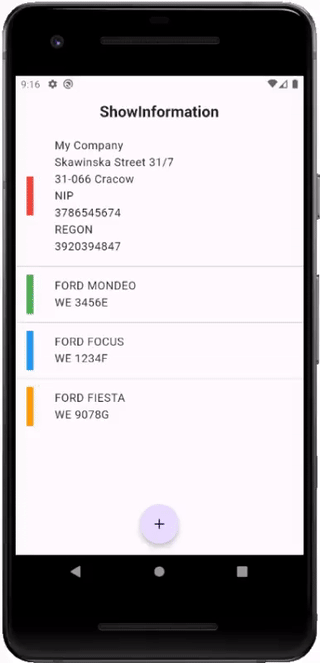
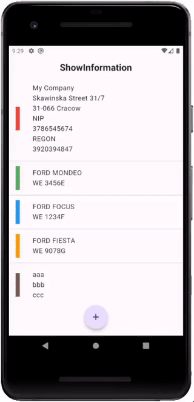
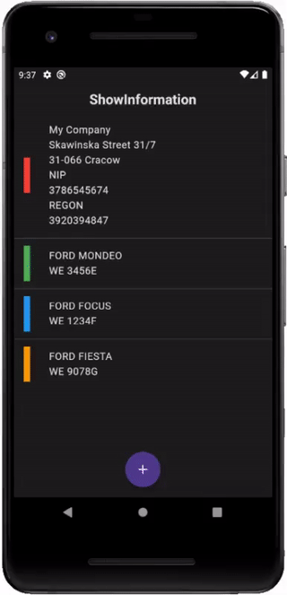

<a href="https://github.com/gzaber/show_information/actions"></a>
<a href="https://codecov.io/gh/gzaber/show_information"></a>
<a href="https://opensource.org/licenses/MIT"></a>

# show_information

A mobile application for showing instead of telling frequently used information.  
For example, company data and car registration number for an invoice.  
The information may be difficult to remember or pronounce, or it may be noisy all around.

&nbsp;
[](.recordings/vid1.gif)
&nbsp;
[](.recordings/vid2.gif)
&nbsp;
[](.recordings/vid3.gif)

## Table of contents

- [Features](#features)
- [Packages](#packages)
- [Setup](#setup)
- [Test](#test)
- [Run](#run)

## Features

- information list
- information preview
- create, update, delete information
- set text style
- light / dark theme
- supported locales: en, pl

## Packages

- equatable
- flutter_bloc
- flutter_slidable
- objectbox

## Setup

Clone or download this repository.  
Use the following command to install all the dependencies:

```
$ flutter pub get
```

## Test

Run the tests using your IDE or using the following command:

```
$ flutter test --coverage
```

For local Flutter packages run the above command in the package root directory.  
For local Dart packages run the following commands in the package root directory:

```
$ dart pub global activate coverage
$ dart pub global run coverage:test_with_coverage
```

## Run

Run the application using your IDE or using the following command:

```
$ flutter run
```
